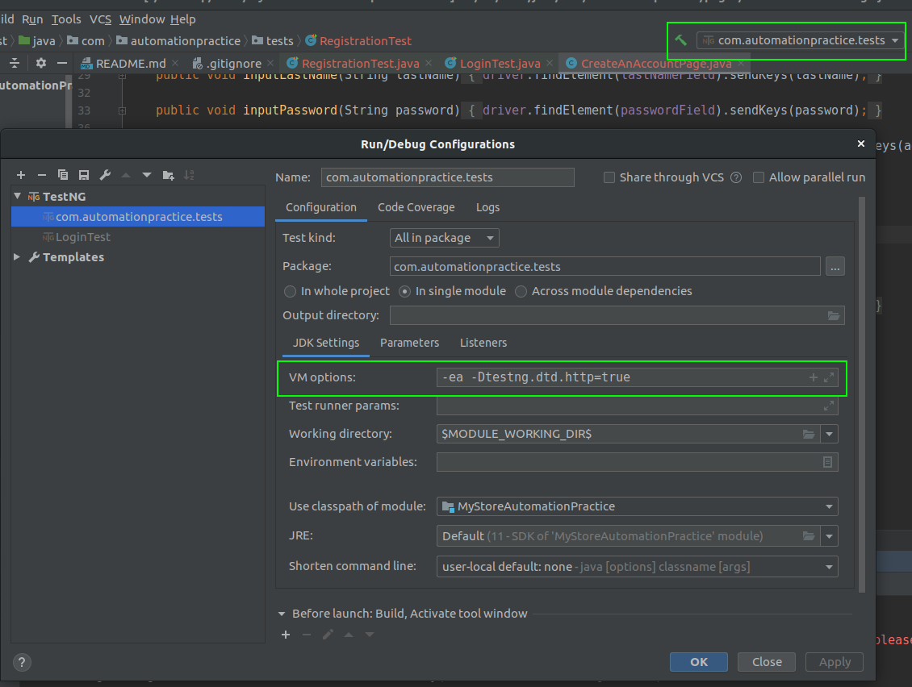

# mystore-automation-practice-tests
Automated UI tests of a practice website MyStore written in Java and Selenium

# Implemented test cases
MS_UM_REG_1 - Register a new account with correct personal data

MS_UM_LOG_1 - Log in to the account with correct email and password

# How to run
The project uses Java 11.

It includes a ChromeDriver version 87.0.4280.88 so the Chrome browser in the same version is needed.

To run the tests editing the run configuration is necessary.

Here is an example of neccessary configuration for a whole tests module:

